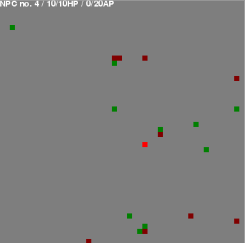

# Pygame TBS

Aka **Silent Storm 2D** aka **Gray Haze**, this project contains the first sketches of a new [Silent Storm](https://en.wikipedia.org/wiki/Silent_Storm) like game.
First written in Python, using pygame, to explore path finding and turn based processes, the game ([Gray Haze](https://github.com/drikusroor/gray-haze)) will eventually be made in the Godot engine and its code will be found in a separate repository.

Thank you,

Drikus Roor



## To use:

### Install dependencies, using Anaconda, using the Anaconda Prompt:

```cmd
conda env create -f pygame-tbs.yml
```

### Start "game"

```cmd
python main.py
```
